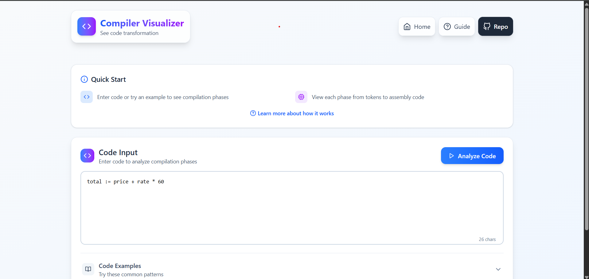

# Compiler Visualizer


A comprehensive, interactive tool for visualizing the phases of a compiler. This educational platform helps programmers and students understand how compilers work by providing real-time visualization of lexical analysis, syntax analysis, semantic analysis, intermediate code generation, optimization, and code generation.

## Live Demo

[Compiler Visualizer](https://compiler-visualizer-seven.vercel.app/)

## Features

- **Interactive Code Analysis**: Enter code snippets and see the compilation process in action
- **Multi-Phase Visualization**:

  - **Lexical Analysis**: View tokenization results in a filterable, sortable table
  - **Syntax Analysis**: Explore the Abstract Syntax Tree (AST) in both visual and text modes
  - **Semantic Analysis**: Check type correctness and examine the symbol table
  - **Intermediate Code**: See how your code translates to Three-Address Code (TAC)
  - **Code Optimization**: Compare unoptimized and optimized code side-by-side
  - **Code Generation**: View the resulting assembly code

- **Educational Tools**:
  - Zoom-in/out of the AST visualization
  - Toggle node labels
  - Copy generated code for further study
  - Detailed explanations of each compilation phase

## Screenshot



## Getting Started

1. Clone this repository:

   ```bash
   git clone https://github.com/danielace1/compiler-visualizer.git
   cd compiler-visualizer
   ```

2. Install dependencies:

   ```bash
   npm install
   # or
   yarn install
   ```

3. Start the development server:

   ```bash
   npm run dev
   # or
   yarn dev
   ```

4. Open your browser and visit `http://localhost:5173`

## Technologies

- **Frontend**:

  - React.js - UI framework
  - Tailwind CSS - Styling
  - React Icons - UI icons
  - React D3 Tree - Tree visualization

- **Compilation Engine**:
  - Groq API - AI-powered code analysis service
  - Custom lexer and parser
  - AST generator
  - TAC converter
  - Code optimizer

## Educational Value

The Compiler Visualizer is designed as an educational tool to help:

- Computer Science students understand compiler construction
- Self-taught programmers learn about language processing
- Educators teach compiler theory with visual aids
- Developers gain insights into how their code is processed

## Contributing

Contributions are welcome! Feel free to open [issues](https://github.com/danielace1/compiler-visualizer/issues) or submit pull requests.

1. [Fork](https://github.com/danielace1/compiler-visualizer/fork) the repository
2. Create your feature branch: `git checkout -b feature/amazing-feature`
3. Commit your changes: `git commit -m 'Add some amazing feature'`
4. Push to the branch: `git push origin feature/amazing-feature`
5. Open a [pull request](https://github.com/danielace1/compiler-visualizer/pulls)

## License

[MIT](LICENSE)

## Acknowledgements

- [React D3 Tree](https://github.com/bkrem/react-d3-tree) for the tree visualization
- [Groq](https://groq.com/) for providing the powerful AI API used in code analysis
- The academic papers and resources on compiler construction that inspired this project.

---

Made with ❤️ by [Sudharsan](https://github.com/danielace1)
